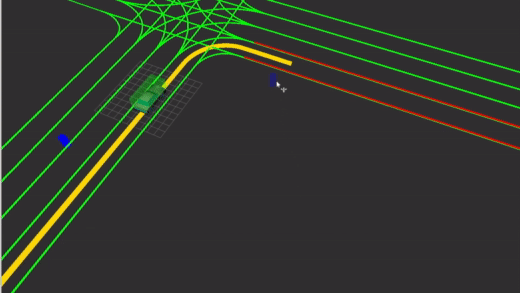
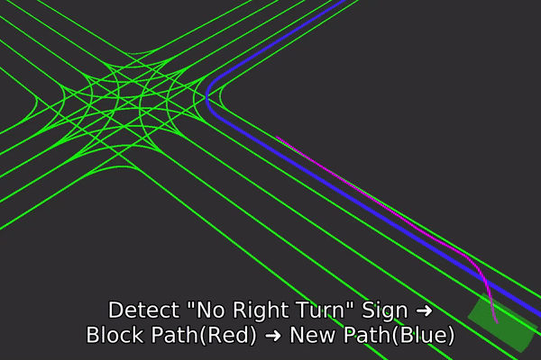
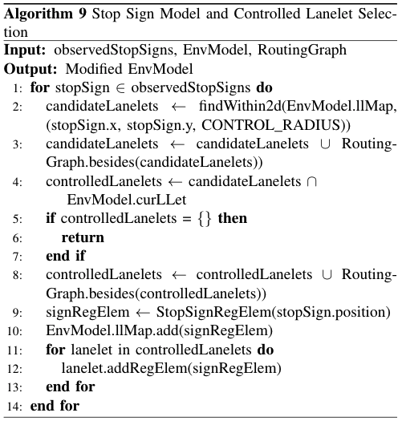
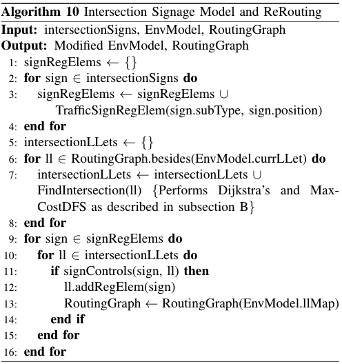
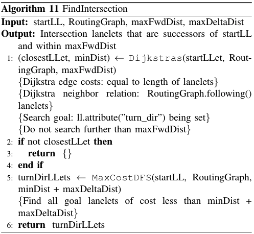
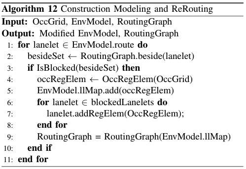
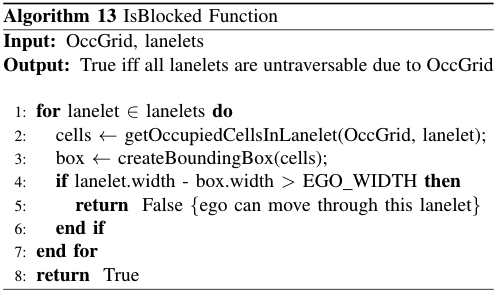
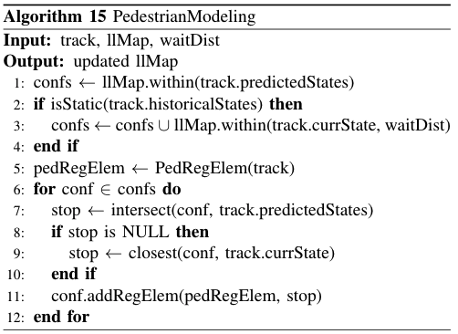
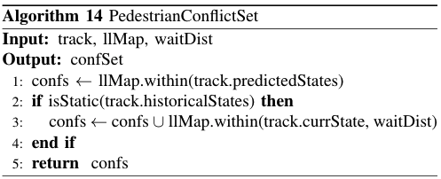
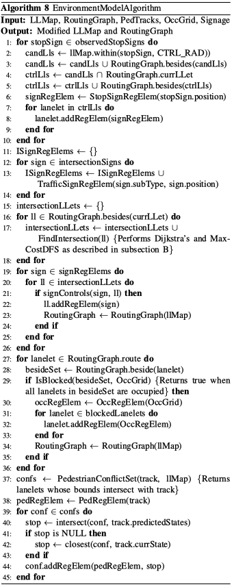

# Environment Modeling Techniques for Enhanced Behavioral Planning in Urban Autonomous Driving

## Abstract
Environment modeling is the backbone of how autonomous agents understand the world, and therefore has significant implications for decision-making and verification. Urban driving environments are challenging to model due to the large number of heterogeneous features and high level of uncertainty associated with the state of those features. Motivated by the success of *a priori* relational modeling frameworks such as Lanelet2, in this letter, we present a novel method for extending the *a priori* relationship graph to include online observations, creating a unified environment model of both *a priori* and online data sources. The proposed techniques focus on a finite set of heterogeneous features: stop signs, signs affecting intersection traversal (e.g. no X-turn), construction roadway blockages, and pedestrian movement prediction. The overall framework can be expanded to include a wide range of other features in a fashion that does not increase the complexity of behavioral planning. Qualitative and quantitative assessments have been conducted to demonstrate the effectiveness of the proposed model in reducing the complexity of the behavioral planning.

## Videos

### GIFs
| Pedestrian modeling demo        | Intersection signage modeling demo | 
| ------------- |:-------------:|
|      |  |
### YouTube Videos
| Full pedestrian modeling demo        | Presentation on main ideas |
| ------------- |:-------------:|
|       |  |
## Feature Design Pseudo Code

Stop Sign Model            |  Intersection Traffic Sign Model |  Occupancy Model |  Pedestrian Model | Combined Model
:-------------------------:|:-------------------------:|:-------------------------:|:-------------------------:|:-------------------------:
    |      |      |       | 

## Source Code
Our ROS package [pp_env_model](src/env_model) contains the C++ implementation of our environment model. The [lanelet_service.cpp](src/env_model/src/lanelet_service.cpp) node exposes a ROS service loads and serves Lanelet2 files over the ROS network. The [src/env_model/src/env_model.cpp](env_model.cpp) node queries for the Lanelet2 map it wants to model on top of, subscribes to a variety of online datasource topics, and exposes a `/get_behavior` service which communicates the behavioral planning decisions made based on the model.

## Docker Image
The fastest way to get started using our package is with our docker image that runs nodes in the ROS package, as well as exposes a Code Server port through which you edit the code with ease. The image is available in this repositories image registry, pull it locally using `COMING SOON`

